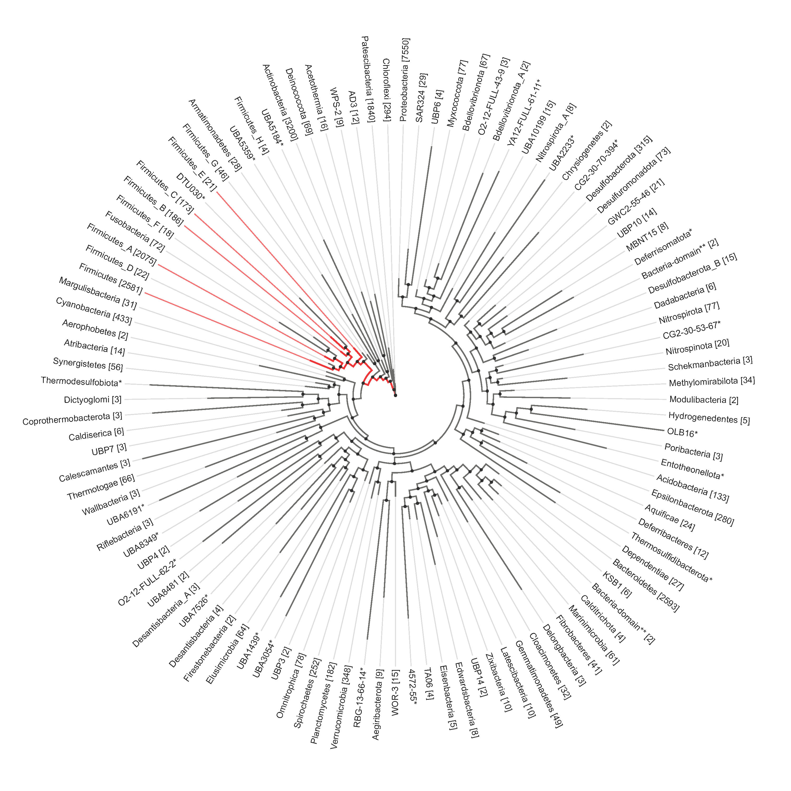

## Setup Libraries
```{r, results="hide"}
library(ggplot2)
library(stringr)
library(reshape2)
library(plyr)
library(gplots)
library(openxlsx)
library(ggpubr)
library(ggsignif)
library(knitr)
library(adephylo)
library(phylobase)
library(ape)
library(picante)
library(phytools)
library(segmented)
library(tidyr)
library(dplyr)
```

## Download BLAST results and metadata

```{r, results="hide"}
REF_HITS <- read.table("../data/WW_REFERENCE_BLAST_OUT.txt", header = F, sep="\t")
REF_META <- read.xlsx(xlsxFile = "../data/WWRefence_Metadata.xlsx", sheet = 1)
UBA_HITS_DATA <- read.xlsx("../data/tyson_genome_list_1201_firms.xlsx")
#UBA_HITS <- read.table("../data/B_subtilis_spo_157_gene_in_PARKS_FIRMICUTES.txt",
#                       header = F, sep="\t")
UBA_HITS <- read.table("../data/WW_PARKES_ET_AL_FIRMS.txt",
                       header = F, sep="\t")
REF_RIBOS <- read.table("../data/ribo_prot_REFS2.txt", header = F, sep="\t")
UBA_RIBOS <- read.table("../data/ribo_prot_PARKS2.txt", header = F, sep="\t")
UBA_META <- read.xlsx(xlsxFile = "../data/tyson_genome_list_1201_firms.xlsx", sheet=1)
```

## Combine Data

```{r, results="hide"}
colnames(REF_HITS) <- c("qseqid","sseqid","pident","length","qlen","slen","mismatch",
                        "gapopen","qstart","qend","sstart","send","qcov","evalue","bitscore")
REF_HITS <- unique(REF_HITS)
REF_HITS <- REF_HITS[REF_HITS$qcov >= 80,]
REF_HITS <- REF_HITS[REF_HITS$bitscore >= 80,]
REF_HITS <- REF_HITS[order(REF_HITS$bitscore, decreasing = T),]
REF_HITS <- REF_HITS[!duplicated(REF_HITS$sseqid),]

REF_HITS <- REF_HITS[order(REF_HITS$bitscore, decreasing = T),]
REF_GENOMES <- strsplit(as.vector(unlist(strsplit(as.vector(REF_HITS$sseqid),
               "\\|"))[grep("_", unlist(strsplit(as.vector(REF_HITS$sseqid),
               "\\|")))]),"_")
Nuccore_ID = ""
for(i in 1:length(REF_GENOMES)){
  if(REF_GENOMES[[i]][1] == "NC" | REF_GENOMES[[i]][1] == "NZ"){
    p <- str_c(REF_GENOMES[[i]][c(1,2)],"", collapse = "_")
  }
  else(
    p <- str_c(REF_GENOMES[[i]][c(1)],"")
  )
  Nuccore_ID[i] <- p
}
REF_HITS$Nuccore_ID <- Nuccore_ID

feature_type = ""
for(i in 1:length(REF_GENOMES)){
  if(REF_GENOMES[[i]][1] == "NC" | REF_GENOMES[[i]][1] == "NZ"){
    p <- REF_GENOMES[[i]][c(3)]
  }
  else(
    p <- REF_GENOMES[[i]][c(2)]
  )
  feature_type[i] <- p
}
REF_HITS$feature_type <- feature_type
RefSeq_ID = ""
for(i in 1:length(REF_GENOMES)){
  if(REF_GENOMES[[i]][1] == "NC" | REF_GENOMES[[i]][1] == "NZ"){
    p <- str_c(REF_GENOMES[[i]][c(4,5)],"", collapse = "_")
  }
  else(
    p <- str_c(REF_GENOMES[[i]][c(3)],"", collapse = "_")
  )
  RefSeq_ID[i] <- p
}
REF_HITS$RefSeq_ID <- RefSeq_ID

gene_names <- unlist(strsplit(as.vector(REF_HITS$qseqid),
"\\|"))[grep("_",
unlist(strsplit(as.vector(REF_HITS$qseqid), "\\|")))]
gene_names_spl <- strsplit(gene_names, "_")
unlist(strsplit(gene_names, "_"))
is.odd <- function(x) x %% 2 != 0
gene_names <- unlist(strsplit(gene_names,
"_"))[seq(from=1,
to=length(unlist(strsplit(gene_names, "_"))))[is.odd(seq(from=1,
to=length(unlist(strsplit(gene_names, "_")))))]]
REF_HITS$Gene_Names <- gene_names
REF_HITS <- merge(REF_HITS, REF_META)
#Check to make sure all the genes are in REF_HITS set after filtering
list_genes<-unique(REF_HITS$Gene_Names)
#setdiff(list_genes, REF_HITS$Gene_Names)
```

### plot abundances of genes in reference dataset
\newpage
\blandscape
```{r, fig.width= 11, fig.height=8.5}
barplot(table(REF_HITS$Gene_Names)[order(table(REF_HITS$Gene_Names))], cex.names = 0.25, 
        las= 2, main = "Ranked Abundance of Sporulation Genes (Reference Set)")
```

\elandscape

\newpage
### Label spore formers and non spore formers in reference set
```{r, results="hide"}
spore_cols <- REF_HITS[,c(23,27)]
genome_gene_count <- as.data.frame(table(spore_cols$Assembly))
colnames(genome_gene_count) <- c("Assembly", "Freq")
spore_cols <- unique(spore_cols)
spore_cols<- merge(spore_cols, genome_gene_count)
spore_cols <- spore_cols[order(spore_cols$Freq),]
spore_cols$cols <- spore_cols$`Spore.Forming.(Weller.and.Wu)`
spore_cols[spore_cols$cols == "Y",]$cols <- "black"
spore_cols[spore_cols$cols == "N",]$cols <- "grey"
```
\newpage
\blandscape
```{r, fig.width= 11, fig.height=8.5}
barplot(spore_cols$Freq, las= 2, cex.axis = 1, cex.names = 0.25,
        names.arg = spore_cols$Assembly, col=spore_cols$cols,
        main="Ranked Abundance of Sporulation Genes in Genomes (Reference Set)")
```
\elandscape

\newpage
### Convert abundance to presence/abscene
```{r, results="hide"}
gene_by_genome <- table(REF_HITS$Gene_Names, REF_HITS$Assembly)
gene_by_genome[gene_by_genome > 0] <- 1
gene_by_genome_df <- as.data.frame(gene_by_genome)
colnames(gene_by_genome_df) <- c("Gene_Names", "Assembly", "Presence")
gene_by_genome_df <- merge(gene_by_genome_df, spore_cols)
gene_by_genome_df[order(gene_by_genome_df$Freq),]
```
\newpage
\blandscape
```{r, fig.width= 11, fig.height=8.5}
heatmap.2(gene_by_genome, trace="none", margins = c(10,10), cexRow=2,
          cexCol=0.25,
          key = FALSE, sepwidth=c(0.5,0.5), sepcolor="black")
```
\elandscape
\newpage
```{r, results= "hide"}
gene_presence <- ddply(gene_by_genome_df, .(Gene_Names), summarise, sum_gene_presence = sum(Presence))
gene_by_genome_df <- merge(gene_by_genome_df, gene_presence)
gene_by_genome_df <- gene_by_genome_df[order(gene_by_genome_df$sum_gene_presence),]
```

### Convert presence of Gene to percent of presence in among the 200 Genomes
```{r, results="hide"}
gene_by_genome_df_hits <- gene_by_genome_df[gene_by_genome_df$Presence > 0,]
sporu_vs_non <- table(gene_by_genome_df_hits$Gene_Names ,gene_by_genome_df_hits$cols)
sporu_vs_non <- melt(sporu_vs_non)

sporu_vs_non$Percent_Core_Set = sporu_vs_non$value/200
colnames(sporu_vs_non) <- c("Gene_Names", "cols", "hits", "Percent_Core_Set")
```

\newpage
\blandscape
### Plot prevalence of genes in reference dataset in ranked order
```{r, fig.width=11, fig.height=8.5}
ggplot(sporu_vs_non,
       aes(y=Percent_Core_Set,
                         x=reorder(Gene_Names,
                                   -rep(sporu_vs_non[sporu_vs_non$cols == "black",]$Percent_Core_Set +
                                                                          sporu_vs_non[sporu_vs_non$cols == "grey",]$Percent_Core_Set, 2)),
           color=cols)) +
  geom_point(stat="identity", size=6, alpha=0.75) +
  ggtitle("Rank Prevalence of Sporulation Gene in Reference Set") + xlab("Gene_Names") +
  ylab("Percent Prevalence in Reference Set") +
  theme_bw(base_size = 10) + scale_color_discrete("Sporulator", labels=c("Yes", "No")) +
  theme(axis.text.x = element_text(angle = 90, vjust = 0.4, size = 4))
```
\elandscape

\newpage
### Weight the prevalence of genes in the reference dataset

The weight is equal to the prevalence of a gene in the reference dataset among sporulators minus the prevalence of a gene in the reference dataset among nonsporulators all divided by the prevalence of a gene in the reference dataset among sporulators. This allows for a gene that is a present in exclusively sporulator to count as one and a gene with some representation among non-sporulators to be discounted by that prevalence. In some cases the genes more prevalent in nonsporulator than sporulators and that negative value was returned to a value of zero.

```{r, results="hide"}
gene_weights <- as.data.frame(cbind(as.vector(sporu_vs_non[sporu_vs_non$cols == "black",]$Gene_Names),
                                    as.vector(as.numeric((sporu_vs_non[sporu_vs_non$cols == 
                                                                         "black",]$Percent_Core_Set-sporu_vs_non[sporu_vs_non$cols == "grey",]$Percent_Core_Set)/sporu_vs_non[sporu_vs_non$cols == "black",]$Percent_Core_Set))))
colnames(gene_weights) <- c("Gene_Names", "weight")
gene_weights$weight <- as.numeric(as.character(gene_weights$weight))
gene_weights[gene_weights$weight < 0,]$weight <- 0
gene_by_genome_df_hits <- merge(gene_by_genome_df_hits, gene_weights)

weighted_percents <- ddply(gene_by_genome_df_hits, .(Assembly), summarise, weighted_percent= sum(weight)/150)
sporu_vs_non <- table(gene_by_genome_df_hits$Assembly ,gene_by_genome_df_hits$cols)
sporu_vs_non <- melt(sporu_vs_non)
sporu_vs_non <- sporu_vs_non[sporu_vs_non$value != 0, ]
sporu_vs_non$Percent_Core_Set = sporu_vs_non$value/150
colnames(sporu_vs_non) <- c("Assembly", "cols", "hits", "Percent_Core_Set")

sporu_vs_non <- merge(sporu_vs_non, weighted_percents)
```

\newpage
\blandscape
### Plot
```{r, fig.width= 11, fig.height=8.5}
ggplot(sporu_vs_non, aes(y=weighted_percent*100, x=reorder(Assembly, -(hits)), color=cols)) +
  geom_point(stat="identity", size=6, alpha = 0.5) +
  ggtitle("Rank Prevalence of Sporulation Gene in Reference Set") + xlab("Assembly") +
  ylab("Percent of Sporulation Gene Set") +
  theme_bw(base_size = 10) + scale_color_discrete("Sporulator", labels=c("Yes", "No")) +
  theme(axis.text.x = element_text(angle = -90, vjust = 0.4, hjust = 0, size = 8)) 
```

\newpage

### Plot
```{r, fig.width= 11, fig.height=8.5}
p <- ggplot(sporu_vs_non) +
  geom_density(aes(x=weighted_percent, fill=cols), alpha=0.2, adjust=2) +
  xlab("Weighted Percent of Sporulation Gene Set") +
  scale_fill_discrete("Sporulator", labels=c("Yes", "No", "?")) +
  theme_minimal(base_size = 10)
p
```
\elandscape
\newpage

### Bring in Tyson dataset
```{r, results="hide"}
colnames(UBA_HITS) <- c("qseqid","sseqid","pident","length","qlen","slen","mismatch",
                        "gapopen","qstart","qend","sstart","send","evalue","bitscore")
UBA_HITS$qcov <- ((UBA_HITS$qend - UBA_HITS$qstart + 1)/UBA_HITS$slen)*100

UBA_HITS$Genome = str_sub(UBA_HITS$sseqid,1,4)
list_genomes<-unique(UBA_HITS$Genome)


gene_names <- unlist(strsplit(as.vector(UBA_HITS$qseqid),
                              "\\|"))[grep("_", unlist(strsplit(as.vector(UBA_HITS$qseqid),
                                                                "\\|")))]
gene_names_spl <- strsplit(gene_names, "_")

is.odd <- function(x) x %% 2 != 0
gene_names <- unlist(strsplit(gene_names, "_"))[seq(from=1,
to=length(unlist(strsplit(gene_names, "_"))))[is.odd(seq(from=1,
to=length(unlist(strsplit(gene_names, "_")))))]]

UBA_HITS$Gene_Names <- gene_names
list_genes<-unique(UBA_HITS$Gene_Names)

UBA_HITS <- unique(UBA_HITS)
UBA_HITS <- UBA_HITS[UBA_HITS$qcov >= 80,]
UBA_HITS <- UBA_HITS[UBA_HITS$bitscore >= 80,]

UBA_HITS <- UBA_HITS[order(UBA_HITS$bitscore, decreasing = T),]

UBA_HITS <- UBA_HITS[!duplicated(UBA_HITS$sseqid),]

genomes_not_found <- setdiff(list_genomes, UBA_HITS$Genome)
genes_not_found <- setdiff(list_genes, UBA_HITS$Gene_Names)


UBA_HITS$Genome = str_sub(UBA_HITS$sseqid,1,4)

UBA_HITS_DATA$Genome = str_sub(UBA_HITS_DATA$`DDBJ/ENA/GenBank.Accession`,1,4)
UBA_HITS <- merge(UBA_HITS, UBA_HITS_DATA)

UBA_GENES_GENOMES <-UBA_HITS[,c(17,19)]


setarr <- setdiff(UBA_GENES_GENOMES$Gene_Names, REF_HITS$Gene_Names)

UBA_GENES_GENOMES <- UBA_GENES_GENOMES[UBA_GENES_GENOMES$Gene_Names != setarr[1],]
UBA_GENES_GENOMES <- UBA_GENES_GENOMES[UBA_GENES_GENOMES$Gene_Names != setarr[2],]
UBA_GENES_GENOMES <- UBA_GENES_GENOMES[UBA_GENES_GENOMES$Gene_Names != setarr[3],]
#UBA_GENES_GENOMES <- UBA_GENES_GENOMES[UBA_GENES_GENOMES$Gene_Names != setarr[4],]
#UBA_GENES_GENOMES <- UBA_GENES_GENOMES[UBA_GENES_GENOMES$Gene_Names != setarr[5],]
#UBA_GENES_GENOMES <- UBA_GENES_GENOMES[UBA_GENES_GENOMES$Gene_Names != setarr[6],]
#UBA_GENES_GENOMES <- UBA_GENES_GENOMES[UBA_GENES_GENOMES$Gene_Names != setarr[7],]
#UBA_GENES_GENOMES <- UBA_GENES_GENOMES[UBA_GENES_GENOMES$Gene_Names != setarr[8],]
#UBA_GENES_GENOMES <- UBA_GENES_GENOMES[UBA_GENES_GENOMES$Gene_Names != setarr[9],]
#UBA_GENES_GENOMES <- UBA_GENES_GENOMES[UBA_GENES_GENOMES$Gene_Names != setarr[10],]
#UBA_GENES_GENOMES <- UBA_GENES_GENOMES[UBA_GENES_GENOMES$Gene_Names != setarr[11],]
#UBA_GENES_GENOMES <- UBA_GENES_GENOMES[UBA_GENES_GENOMES$Gene_Names != setarr[12],]
#UBA_GENES_GENOMES <- UBA_GENES_GENOMES[UBA_GENES_GENOMES$Gene_Names != setarr[13],]

genes_not_found <- setdiff(REF_HITS$Gene_Names, UBA_GENES_GENOMES$Gene_Names)

count_by_gene <- as.data.frame(table(UBA_GENES_GENOMES$UBA.Genome.ID,UBA_GENES_GENOMES$Gene_Names))

count_by_gene[count_by_gene$Freq > 0,]$Freq <- 1
colnames(count_by_gene) <- c("Assembly", "Gene_Names", "Presence")

genes_not_found <- as.data.frame(cbind(genes_not_found, rep(0, length(genes_not_found))))
colnames(genes_not_found) <- c("Gene_Names","Presence")


genomes_not_found <-setdiff(UBA_HITS_DATA$UBA.Genome.ID, count_by_gene$Assembly)
genomes_not_found <- as.data.frame(cbind(genomes_not_found,
                                         rep(0, length(genomes_not_found))))
colnames(genomes_not_found) <- c("Assembly","Presence")


not_founds <- merge(c(as.vector(unique(genes_not_found$Gene_Names)),
                      as.vector(unique(count_by_gene$Gene_Names))),
                    c(as.vector(unique(count_by_gene$Assembly)),
                      as.vector(unique(genomes_not_found$Assembly))))
 


not_founds$Presence <- 0
not_founds <- not_founds[c(2,1,3)]
colnames(not_founds) <- c("Assembly","Gene_Names","Presence")
count_by_gene <- rbind(count_by_gene, not_founds)
```

```{r, results="hide"}
freq_Parks<- ddply(count_by_gene, .(Gene_Names), summarise, Freq=sum(as.numeric(Presence)))
count_by_gene <- merge(count_by_gene, freq_Parks)
count_by_gene$`Spore.Forming.(Weller.and.Wu)` <- "?"
count_by_gene$cols <- "blue"
gene_presence_Parks<- ddply(count_by_gene, .(Assembly),
                            summarise, sum_gene_presence=sum(as.numeric(Presence)))
count_by_gene <- merge(count_by_gene, gene_presence_Parks)

count_by_gene <- count_by_gene[c(2,1,3,5,4,6,7)]

count_by_gene_hits <- count_by_gene[count_by_gene$Presence > 0,]
count_by_gene_hits <- merge(count_by_gene_hits, gene_weights)


weighted_percents <- ddply(count_by_gene_hits, .(Assembly),
                           summarise, weighted_percent= sum(weight)/150)

count_by_gene_hits_count <- table(count_by_gene_hits$Gene_Names ,count_by_gene_hits$cols)
count_by_gene_hits_count <- melt(count_by_gene_hits_count)
count_by_gene_hits_count$Percent_Core_Set = count_by_gene_hits_count$value/1201
colnames(count_by_gene_hits_count) <- c("Gene_Names", "cols", "hits", "Percent_Core_Set")
```
\newpage
\blandscape
### Plot
```{r, fig.width= 11, fig.height=8.5}
ggplot(count_by_gene_hits_count,
       aes(y=Percent_Core_Set, x=reorder(Gene_Names, -hits), color=cols)) +
  geom_point(stat="identity", size=6, alpha=0.75) +
  xlab("Gene_Names") +
  ylab("Percent Prevalence in PARKS Set") +
  theme_bw(base_size = 10) +
  scale_color_discrete("Sporulator", labels=c("?")) +
  theme(axis.text.x = element_text(angle = 90, vjust = 0.4, size = 4))
```
\elandscape
\newpage

```{r, results="hide"}
count_by_gene_hits_count <- count_by_gene[count_by_gene$Presence > 0,]
count_by_gene_hits_count <- table(count_by_gene_hits_count$Assembly ,count_by_gene_hits_count$cols)
count_by_gene_hits_count <- melt(count_by_gene_hits_count)
colnames(count_by_gene_hits_count) <- c("Assembly", "cols", "hits")
count_by_gene_hits_count$Percent_Core_Set = count_by_gene_hits_count$hits/150
count_by_gene_hits_count <-merge(count_by_gene_hits_count, weighted_percents)
```


```{r}
PARKS_and_REF <- rbind(sporu_vs_non, count_by_gene_hits_count)
```
\newpage
\blandscape
### Plot
```{r, fig.width= 11, fig.height=8.5}
ggplot(PARKS_and_REF, aes(y=Percent_Core_Set, x=reorder(Assembly, -hits), color=cols)) +
  geom_point(stat="identity", size=6, alpha=0.75) +
  xlab("Gene_Names") +
  ylab("Percent Prevalence\nof Sporulation Set in Genomes") +
  theme_bw(base_size = 10) +
  scale_color_discrete("Sporulator", labels=c("Yes","No","?")) +
  theme(axis.text.x = element_text(angle = 90, vjust = 0.4, size = 4))
```
\newpage

### Plot
```{r, fig.width= 11, fig.height=8.5}
p <- ggplot(PARKS_and_REF) +
  geom_dotplot(data=PARKS_and_REF, aes(x=Percent_Core_Set*150, fill=cols),
               alpha=0.5, dotsize = 1.2, binwidth = 1) +
  scale_fill_discrete("Sporulator", labels=c("Yes", "No", "?")) +
  theme_bw(base_size = 20)
 
p <- p + geom_density(aes(x=Percent_Core_Set*150, fill=cols), alpha=0.2, adjust=5) +
  xlab("Number of Sporulation Genes") +
  scale_fill_discrete("Sporulator", labels=c("Yes", "No", "?")) +
  theme_bw(base_size = 20) + scale_x_continuous(limits=c(0,160)) +
  scale_y_continuous(limits=c(0,0.051))
p
```

\newpage
### Plot
```{r, fig.width= 11, fig.height=8.5}
p <- ggplot(PARKS_and_REF) +
  geom_dotplot(data=PARKS_and_REF, aes(x=weighted_percent, fill=cols),
               alpha=0.5,dotsize = 1.2, binwidth = 1/180) +
  scale_fill_discrete("Sporulator", labels=c("Yes", "No"))
  
p <- p +
  geom_density(aes(x=as.numeric(weighted_percent), fill=cols), alpha=0.2, adjust=5) +
  xlab("Weighted Percent of Sporulation Gene Set") +
  scale_fill_discrete("Sporulator", labels=c("Yes", "No", "?")) +
  scale_x_continuous(limits=c(0,1)) + theme_bw(base_size = 20)
mu <- ddply(PARKS_and_REF, "cols", summarise,
            grp.mean=mean(Percent_Core_Set), grp.sd= sd(Percent_Core_Set))

weighted_mu <- ddply(PARKS_and_REF, "cols", summarise,
                     grp.mean=mean(weighted_percent), grp.sd= sd(weighted_percent))
p <- p +
  geom_vline(aes(xintercept=weighted_mu[2,2] +
                   3.290*weighted_mu[2,3]), size=2)
p <- p +
  geom_vline(aes(xintercept=weighted_mu[1,2] - 1*weighted_mu[1,3]), size=2)
p + theme_classic2(base_size = 40) + theme(legend.justification = c(1, 1), legend.position = c(1,1))
```
\elandscape
\newpage
```{r}
PARKS <- PARKS_and_REF[PARKS_and_REF$cols == "blue", ]
PARKS$LIKELY_SPORULATOR <- PARKS_and_REF[PARKS_and_REF$cols == "blue", ]$weighted_percent > weighted_mu[2,2] +
  3.290*weighted_mu[2,3]
PARKS$SPORULATOR <- PARKS_and_REF[PARKS_and_REF$cols == "blue", ]$weighted_percent > weighted_mu[1,2] - 1*weighted_mu[1,3]

PARKS <- ddply(PARKS, .(Assembly), mutate,
               weighted_percent_difference = (Percent_Core_Set - weighted_percent)/Percent_Core_Set,
               weighted_difference = (Percent_Core_Set - weighted_percent))
```
\newpage
\blandscape
### Plot
```{r, fig.width= 11, fig.height=8.5}
anno_df1 <- compare_means(weighted_percent ~ SPORULATOR, data = PARKS, method = "t.test", p.adjust.method = "holm") %>%
 mutate(y_pos = 1, p.adj = format.pval(p.adj, digits = 2))

ggplot(PARKS) +
  geom_boxplot(aes(x=SPORULATOR, y=weighted_percent), position = "dodge") +
  geom_jitter(aes(x=SPORULATOR, y=weighted_percent, color=LIKELY_SPORULATOR)) +
  theme_bw(base_size = 18) +
    geom_signif(
    data=anno_df1, 
    aes(xmin = group1, xmax = group2, annotations = p.adj, y_position = y_pos), 
    manual= TRUE
  )
```

```{r, fig.width= 11, fig.height=8.5}
ggplot(PARKS) +
  geom_boxplot(aes(x=SPORULATOR, y=weighted_percent_difference), position = "dodge") +
  geom_jitter(aes(x=SPORULATOR, y=weighted_percent_difference, color=LIKELY_SPORULATOR)) +
  theme_bw(base_size = 18)
```
\elandscape
\newpage
```{r}
REFS <- PARKS_and_REF[PARKS_and_REF$cols == "black" | PARKS_and_REF$cols == "grey", ]

REFS <- ddply(REFS, .(Assembly, cols), mutate,
              weighted_percent_difference = (Percent_Core_Set - weighted_percent)/Percent_Core_Set,
              weighted_difference = (Percent_Core_Set - weighted_percent))
```
\newpage
\blandscape
### Plot
```{r}
anno_df1 <- compare_means(weighted_percent_difference ~ cols, data = REFS, method = "t.test", p.adjust.method = "holm") %>%
 mutate(y_pos = 1, p.adj = format.pval(p.adj, digits = 2))

anno_df2 <- compare_means(weighted_percent ~ cols, data = REFS, method = "t.test", p.adjust.method = "holm") %>%
 mutate(y_pos = 1, p.adj = format.pval(p.adj, digits = 2))

anno_df3 <- compare_means(Percent_Core_Set ~ cols, data = REFS, method = "t.test", p.adjust.method = "holm") %>%
 mutate(y_pos = 1, p.adj = format.pval(p.adj, digits = 2))
```

```{r, fig.width= 11, fig.height=8.5}
ggplot(REFS) + 
  geom_boxplot(aes(x=cols, y=weighted_percent_difference), position = "dodge") +
  geom_jitter(aes(x=cols, y=weighted_percent_difference)) + theme_bw(base_size = 30) +
  scale_x_discrete(labels=(c("Sporulators","Non Sporulators"))) + xlab("") +
    geom_signif(
    data=anno_df1, 
    aes(xmin = group1, xmax = group2, annotations = p.adj, y_position = y_pos), 
    manual= TRUE
  )
PARKS_and_REF$LIKELY_SPORULATOR = as.factor(ifelse(PARKS_and_REF$weighted_percent >= (weighted_mu[2,2] + weighted_mu[2,3]*3.29), "TRUE", "FALSE"))
ggplot(PARKS_and_REF) + 
  geom_violin(aes(x=cols, y=weighted_percent*100), position = "dodge") +
  geom_jitter(aes(x=cols, y=weighted_percent*100, color=LIKELY_SPORULATOR), height=0) +
  theme_classic2(base_size = 30) +
  scale_x_discrete(labels=(c("Sporulators","Non Sporulators", "Test Data"))) + xlab("") + ylab("Weighted Percent") +
  geom_signif(data=anno_df2, aes(xmin = group1, xmax = group2, annotations = p.signif, y_position = y_pos*100), manual= TRUE)
ggplot(PARKS_and_REF) + 
  geom_violin(aes(x=cols, y=log10(weighted_percent*100)), position = "dodge") +
  geom_jitter(aes(x=cols, y=log10(weighted_percent*100), color=LIKELY_SPORULATOR), height=0) +
  theme_classic2(base_size = 30) +
  scale_x_discrete(labels=(c("Sporulators","Non Sporulators", "Test Data"))) + xlab("") + ylab("log10(Weighted Percent)") +
  geom_signif(data=anno_df2, aes(xmin = group1, xmax = group2, annotations = p.signif, y_position = log10(y_pos*100)), manual= TRUE)

ggplot(PARKS_and_REF) + 
     geom_violin(aes(x=cols == "blue", y=weighted_percent*100), position = "dodge") +
     geom_jitter(aes(x=cols == "blue", y=weighted_percent*100, color=LIKELY_SPORULATOR), height=0) + scale_color_manual(values=c("darkgrey", "black")) +
     theme_classic2(base_size = 30) +
     scale_x_discrete(labels=c("Reference", "Test")) + xlab("") + ylab("Weighted Percent") + theme(legend.position = "none") + scale_y_continuous(trans='log10')
library(mclust)
ref.gmm = Mclust(REFS$weighted_percent, G=2)
summary(ref.gmm)
ref.gmm.1 = Mclust(REFS$weighted_percent, G=1)
summary(ref.gmm.1)
logLik(ref.gmm)-logLik(ref.gmm.1)
1-pchisq(90.02748,df=3)

test.gmm = Mclust(PARKS$weighted_percent, G=2)
summary(test.gmm)
test.gmm.1 = Mclust(PARKS$weighted_percent, G=1)
summary(test.gmm.1)
logLik(test.gmm)-logLik(test.gmm.1)
1-pchisq(412.8371,df=3)

plot(density(PARKS$weighted_percent, kernel="gaussian", bw="SJ"))
plot(density(PARKS$weighted_percent, kernel="gaussian", bw=0.13))
density(PARKS$weighted_percent, kernel="gaussian", bw="SJ") -> dens.SJ
density(PARKS$weighted_percent, kernel="gaussian", bw=0.13) -> prox.null

test.sim <- matrix(NA, nrow=length(as.vector(PARKS$weighted_percent)), ncol=10)
for (i in 1:10){
  test.sim[ ,i] <- rnorm(length(as.vector(PARKS$weighted_percent)), sample(as.vector(PARKS$weighted_percent), size=length(as.vector(PARKS$weighted_percent))), prox.null$bw)
}

require(silvermantest)
silverman.test(PARKS$weighted_percent, k=1, M=10000, adjust=F)
silverman.test(PARKS$weighted_percent, k=1, M=10000, adjust=T)

density(REFS$weighted_percent, kernel="gaussian", bw="SJ") -> dens.SJ
density(REFS$weighted_percent, kernel="gaussian", bw=0.13) -> prox.null

ref.sim <- matrix(NA, nrow=length(as.vector(REFS$weighted_percent)), ncol=10)
for (i in 1:10){
  ref.sim[ ,i] <- rnorm(length(as.vector(REFS$weighted_percent)), sample(as.vector(REFS$weighted_percent), size=length(as.vector(REFS$weighted_percent))), prox.null$bw)
}

silverman.test(REFS$weighted_percent, k=1, M=10000, adjust=F)
silverman.test(REFS$weighted_percent, k=1, M=10000, adjust=T)

density(PARKS_and_REF$weighted_percent, kernel="gaussian", bw="SJ") -> dens.SJ
density(PARKS_and_REF$weighted_percent, kernel="gaussian", bw=0.13) -> prox.null

tot.sim <- matrix(NA, nrow=length(as.vector(PARKS_and_REF$weighted_percent)), ncol=100)
for (i in 1:100){
  tot.sim[ ,i] <- rnorm(length(as.vector(PARKS_and_REF$weighted_percent)), sample(as.vector(PARKS_and_REF$weighted_percent), size=length(as.vector(PARKS_and_REF$weighted_percent))), prox.null$bw)
}

silverman.test(PARKS_and_REF$weighted_percent, k=1, M=10000, adjust=F)
silverman.test(PARKS_and_REF$weighted_percent, k=1, M=10000, adjust=T)
```

\newpage

```{r, fig.width= 11, fig.height=8.5}
ggplot(REFS) + 
  geom_boxplot(aes(x=cols, y=weighted_percent), position = "dodge") +
  geom_jitter(aes(x=cols, y=weighted_percent)) + theme_bw(base_size = 30) +
  scale_x_discrete(labels=(c("Sporulators","Non Sporulators"))) + xlab("") +
    geom_signif(
    data=anno_df2, 
    aes(xmin = group1, xmax = group2, annotations = p.adj, y_position = y_pos), 
    manual= TRUE
  )
```
\elandscape
\newpage
\blandscape

```{r, fig.width= 11, fig.height=8.5}
ggplot(REFS) + 
  geom_boxplot(aes(x=cols, y=Percent_Core_Set), position = "dodge") +
  geom_jitter(aes(x=cols, y=Percent_Core_Set)) + theme_bw(base_size = 30) +
  scale_x_discrete(labels=(c("Sporulators","Non Sporulators"))) + xlab("") +
    geom_signif(
    data=anno_df3, 
    aes(xmin = group1, xmax = group2, annotations = p.adj, y_position = y_pos), 
    manual= TRUE
  )
```

With the expanding phylogeny of Firmicutes that has arose from metagenomic binning efforts. We can look back and see if there are new major branches at which we now predict a loss of endosporulation to occur.

As a first pass at this I used the web-based AnnoTree software. The software allows you to visualize the prevalance of genes or sets of genes at varied phylogenetic depth. I selected the 9 genes that formed the most inclusize cluster of "genes for sporulators by sporulators" and visualized their prevalence at the phylum level.
\elandscape
\newpage
```{r}

```

###Phylogentics
##Combine datasets
```{r, results="hide"}
colnames(UBA_RIBOS) <- c("target name","taccession","query name",
  "qaccession","E-value","score","bias","dom E-value","dom score","dom bias",
  "exp","reg","clu","ov","env", "dom","rep","inc")
colnames(REF_RIBOS) <- c("target name","taccession","query name",
  "qaccession","E-value","score","bias","dom E-value","dom score","dom bias",
  "exp","reg","clu","ov","env", "dom","rep","inc")

REF_GENOMES <- strsplit(as.vector(unlist(strsplit(as.vector(REF_RIBOS$`target name`),
               "\\|"))[grep("_", unlist(strsplit(as.vector(REF_RIBOS$`target name`),
               "\\|")))]),"_")
Nuccore_ID = ""
for(i in 1:length(REF_GENOMES)){
  if(REF_GENOMES[[i]][1] == "NC" | REF_GENOMES[[i]][1] == "NZ"){
    p <- str_c(REF_GENOMES[[i]][c(1,2)],"", collapse = "_")
  }
  else(
    p <- str_c(REF_GENOMES[[i]][c(1)],"")
  )
  Nuccore_ID[i] <- p
}
REF_RIBOS$Nuccore_ID <- Nuccore_ID

REF_RIBOS <- merge(REF_RIBOS, REF_META)
```

##Plot Reference Alignment Scores
```{r}
ggplot(REF_RIBOS, aes(x=score)) + geom_density() + facet_wrap(~`query name`)
```

##Make cutoffs based on variance in reference score
```{r, results="hide"}
REF_RIBOS_Cutoff <- REF_RIBOS[REF_RIBOS$score >= 50,]
gen_cutoffs_df <- ddply(REF_RIBOS_Cutoff, .(`query name`),
                        summarise, mean_score = mean(score),
                        sd_score = sd(score), min_score = min(score),
                        max_score = max(score),
                        cutoff=mean(score)-6*sd(score))
```

###Remove matches below cutoff (including Trusted Cutoffs from TIGRFAM)
```{r, results="hide"}
UBA_RIBOS <- rbind(UBA_RIBOS[UBA_RIBOS$`query name` == "NOG.COG0094.clustalo_raw" & UBA_RIBOS$score >= 135.79241,],
  UBA_RIBOS[UBA_RIBOS$`query name` == "NOG.COG0096.clustalo_raw" & UBA_RIBOS$score >= 58.74311,],
  UBA_RIBOS[UBA_RIBOS$`query name` == "TIGR00060" & UBA_RIBOS$score >= 87.85,],
  UBA_RIBOS[UBA_RIBOS$`query name` == "TIGR01009" & UBA_RIBOS$score >= 114.50,],
  UBA_RIBOS[UBA_RIBOS$`query name` == "TIGR01044" & UBA_RIBOS$score >= 73.65,],
  UBA_RIBOS[UBA_RIBOS$`query name` == "TIGR01049" & UBA_RIBOS$score >= 72.75,],
  UBA_RIBOS[UBA_RIBOS$`query name` == "TIGR01050" & UBA_RIBOS$score >= 89.35,],
  UBA_RIBOS[UBA_RIBOS$`query name` == "TIGR01067" & UBA_RIBOS$score >= 111.10,],
  UBA_RIBOS[UBA_RIBOS$`query name` == "TIGR01079" & UBA_RIBOS$score >= 53.70,],
  UBA_RIBOS[UBA_RIBOS$`query name` == "TIGR01164" & UBA_RIBOS$score >= 76.85,],
  UBA_RIBOS[UBA_RIBOS$`query name` == "TIGR01171" & UBA_RIBOS$score >= 174.50,],
  UBA_RIBOS[UBA_RIBOS$`query name` == "TIGR03625" & UBA_RIBOS$score >= 142.90,],
  UBA_RIBOS[UBA_RIBOS$`query name` == "TIGR03635" & UBA_RIBOS$score >= 88.70,],
  UBA_RIBOS[UBA_RIBOS$`query name` == "TIGR03953" & UBA_RIBOS$score >= 130.10,])

REF_RIBOS <- rbind(REF_RIBOS[REF_RIBOS$`query name` == "NOG.COG0094.clustalo_raw" & REF_RIBOS$score >= 135.79241,],
  REF_RIBOS[REF_RIBOS$`query name` == "NOG.COG0096.clustalo_raw" & REF_RIBOS$score >= 58.74311,],
  REF_RIBOS[REF_RIBOS$`query name` == "TIGR00060" & REF_RIBOS$score >= 87.85,],
  REF_RIBOS[REF_RIBOS$`query name` == "TIGR01009" & REF_RIBOS$score >= 114.50,],
  REF_RIBOS[REF_RIBOS$`query name` == "TIGR01044" & REF_RIBOS$score >= 73.65,],
  REF_RIBOS[REF_RIBOS$`query name` == "TIGR01049" & REF_RIBOS$score >= 72.75,],
  REF_RIBOS[REF_RIBOS$`query name` == "TIGR01050" & REF_RIBOS$score >= 89.35,],
  REF_RIBOS[REF_RIBOS$`query name` == "TIGR01067" & REF_RIBOS$score >= 111.10,],
  REF_RIBOS[REF_RIBOS$`query name` == "TIGR01079" & REF_RIBOS$score >= 53.70,],
  REF_RIBOS[REF_RIBOS$`query name` == "TIGR01164" & REF_RIBOS$score >= 76.85,],
  REF_RIBOS[REF_RIBOS$`query name` == "TIGR01171" & REF_RIBOS$score >= 174.50,],
  REF_RIBOS[REF_RIBOS$`query name` == "TIGR03625" & REF_RIBOS$score >= 142.90,],
  REF_RIBOS[REF_RIBOS$`query name` == "TIGR03635" & REF_RIBOS$score >= 88.70,],
  REF_RIBOS[REF_RIBOS$`query name` == "TIGR03953" & REF_RIBOS$score >= 130.10,])
```

##Plot Reference with cutoffs applied
```{r}
ggplot(REF_RIBOS, aes(x=score)) + geom_density() + facet_wrap(~`query name`)
```

##Count the number of genes found in each Assembly
```{r, results="hide"}
#table(REF_RIBOS$Assembly, REF_RIBOS$`query name`)
```

##Plot heatmap of reference set
```{r}
Colors=c("white", "black")
Colors=colorRampPalette(Colors)(5)
heatmap.2(table(REF_RIBOS$Assembly, REF_RIBOS$`query name`), col=Colors, trace="none", margins = c(10,10), cexRow=0.25,
          cexCol=1,
          key = TRUE, sepwidth=c(0.5,0.5), sepcolor="black")
```

##Plot heatmap Tyson dataset
```{r}
UBA_RIBOS$Assembly <- str_sub(UBA_RIBOS$`target name`, 1, 4)
Colors=c("white", "black")
Colors=colorRampPalette(Colors)(5)
heatmap.2(table(UBA_RIBOS$Assembly, UBA_RIBOS$`query name`), col=Colors, trace="none", margins = c(10,10), cexRow=0.25,
          cexCol=1,
          key = TRUE, sepwidth=c(0.5,0.5), sepcolor="black")
```

###Remove all assemblies that don't have a complete single copy set of ribosomal genes and print to csv
```{r, results="hide"}
gene_table <- as.matrix(table(UBA_RIBOS$Assembly, UBA_RIBOS$`query name`))
complete_gene_table_UBA <- gene_table[apply(gene_table, 1, function(row) all(row == 1 )),]
gene_table <- as.matrix(table(REF_RIBOS$Assembly, REF_RIBOS$`query name`))
complete_gene_table_REF <- gene_table[apply(gene_table, 1, function(row) all(row == 1 )),]
Complete_REF_RIBOS <- REF_RIBOS[REF_RIBOS$Assembly %in% rownames(complete_gene_table_REF),]
Complete_UBA_RIBOS <- UBA_RIBOS[UBA_RIBOS$Assembly %in% rownames(complete_gene_table_UBA),]
write.csv(file = "../data/Complete_Set_Ribos_UBA.csv", x = Complete_UBA_RIBOS)
write.csv(file = "../data/Complete_Set_Ribos_REF.csv", x = Complete_REF_RIBOS)

UBA_IDS <- as.data.frame(cbind(UBA_HITS_DATA$Genome, UBA_HITS_DATA$UBA.Genome.ID))
colnames(UBA_IDS) <- c("Assembly", "UBA_ID")

Complete_UBA_META <- merge(Complete_UBA_RIBOS,UBA_IDS)
Complete_UBA_META <- unique(Complete_UBA_META[,c(1,20)])
colnames(Complete_UBA_META) <- c("Genomes","Assembly")

Complete_UBA_META <- merge(PARKS, Complete_UBA_META)

REF_META_HITS <- merge(REF_META, REFS)
Complete_REF_META <- unique(merge(Complete_REF_RIBOS[,c(1,27)], REF_META_HITS))
Complete_REF_META$LIKELY_SPORULATOR <- Complete_REF_META$cols == "black"
Complete_REF_META$SPORULATOR <- Complete_REF_META$cols == "black"
Complete_UBA_META <- Complete_UBA_META[,c(10,2:5,8,9,6,7)]
colnames(Complete_UBA_META) <- c("label",colnames(Complete_UBA_META)[c(2:9)])
Complete_REF_META <- Complete_REF_META[,c(1,14:21)]
colnames(Complete_REF_META) <- c("label",colnames(Complete_REF_META)[c(2:9)])
Complete_META <- rbind(Complete_REF_META, Complete_UBA_META)
rownames(Complete_META) <- Complete_META$label 
Complete_META <- Complete_META[,c(2:9)]
```

```{r, results="hide"}

ribo_tree <- read.tree("../data/outgroup/realignment/alignment/trimmed/concat.tree")
ribo_tree$node.label <- c(1:length(ribo_tree$node.label))

#tips_to_drop <- c('DIUU', 'DIQV', 'DHOQ', 'DBWF', 'DBWT', 'DCJD', 'DKCH', 'DJOB', 'DHAK', 'DHEG', 'DJNL', 'DLIM', 'DEWB', 'DKRQ', 'DJRQ', 'DLGA', 'DBRT', 'DCUC', 'DEWP', 'DGVS', 'DCIT', 'DJQS')
#ribo_tree <- drop.tip(ribo_tree, tips_to_drop)

ribo_tree <- drop.tip(ribo_tree, "Actinoplanes_friuliensis")
ribo_tree <- drop.tip(ribo_tree, "Streptomyces_albus")
ribo_tree <- root(ribo_tree, 814, resolve.root = TRUE)
plot(ribo_tree)
met <- c("patristic")
D <- lapply(met, function(e) distRoot(ribo_tree, method=e) )
D <- as.data.frame(D)
colnames(D) <- c("dist2root")
Complete_META$Assembly <- rownames(Complete_META)
D$Assembly <- rownames(D)
Complete_META <- merge(Complete_META, D)

T <- lapply(met, function(e) distTips(ribo_tree, method=e) )
T <- T[[1]]
T <- melt(as.matrix(T), varnames = c("row", "col"))
tips_no_sames <- T[!(T$row == T$col),]
tips_no_sames <- tips_no_sames[!tips_no_sames$row == "Conexibacter_woesei",]
tips_no_sames <- tips_no_sames[!tips_no_sames$col == "Conexibacter_woesei",]

LS_each_tip <- ""
for(i in 1:nrow(tips_no_sames)){
  LS_each_tip[i] <- Complete_META[which(Complete_META$Assembly == tips_no_sames$row[i]),8]
}
tips_no_sames$rowLS <- ifelse(LS_each_tip, 1, 0)

LS_each_tip <- ""
for(i in 1:nrow(tips_no_sames)){
  LS_each_tip[i] <- Complete_META[which(Complete_META$Assembly == tips_no_sames$col[i]),8]
}
tips_no_sames$colLS <- ifelse(LS_each_tip, 1, 0)
tips_no_sames$matched <- tips_no_sames$rowLS + tips_no_sames$colLS
tips_no_sames$matched <- as.character(tips_no_sames$matched)

ggplot(tips_no_sames, aes(x=value, fill=matched)) +
  geom_density() +
  theme_classic2(base_size = 30) +
  ggtitle("Tip to Tip Distance (NS vs S)") +
  xlab("branch length")
comMeanTtest <- compare_means(value ~ matched, tips_no_sames, method = "t.test", p.adjust.method = "holm") %>%
 mutate(y_pos = 2.7, p.adj = format.pval(p.adj, digits = 2))

ggplot(tips_no_sames, aes(x=matched, y=value)) +
  geom_violin(aes()) +
  theme_classic2(base_size = 30) +
  ggtitle("Tip to Tip Distance (NS vs S)") +
  ylab("branch length") + theme(axis.title.x = element_blank(), axis.text.x = element_text(), plot.title = element_text(hjust = 0.5)) + 
  scale_x_discrete(labels=c("NS vs NS", "NS vs S", "S vs S")) +
    geom_signif(
    data=comMeanTtest, 
    aes(xmin = group1, xmax = group2, annotations = p.adj, y_position = y_pos), 
    manual= TRUE
  )
library(dplyr)
s1 <-sample_n(tips_no_sames, 300)
s1$random_values <- s1$value[shuffle(s1$value)]

comMeanTtest <- compare_means(value ~ matched, s1, method = "t.test", p.adjust.method = "holm") %>%
 mutate(y_pos = 2.7, p.adj = format.pval(p.adj, digits = 2))

ggplot(s1, aes(x=matched, y=value)) +
  geom_violin(aes()) +
  geom_jitter(height = 0) +
  theme_classic2(base_size = 30) +
  ggtitle("Tip to Tip Distance (NS vs S)") +
  ylab("branch length") + theme(axis.title.x = element_blank(), axis.text.x = element_text(), plot.title = element_text(hjust = 0.5)) + 
  scale_x_discrete(labels=c("NS vs NS", "NS vs S", "S vs S")) +
    geom_signif(
    data=comMeanTtest, 
    aes(xmin = group1, xmax = group2, annotations = p.adj, y_position = y_pos), 
    manual= TRUE
  )
melted_s1 <- melt(s1, id.vars = c("row", "col", "rowLS", "colLS", "matched"))

melted_s1[melted_s1$matched == 0,]$matched <- "NS_vs_NS"
melted_s1[melted_s1$matched == 1,]$matched <- "NS_vs_S"
melted_s1[melted_s1$matched == 2,]$matched <- "S_vs_S"
comMeanTtest <- compare_means(value ~ variable, melted_s1, group.by = "matched", method = "t.test", p.adjust.method = "holm") %>%
 mutate(y_pos = 2.7, p.adj = format.pval(p.adj, digits = 2))
ggplot(melted_s1, aes(x=variable, y=value)) +
  geom_violin(aes()) +
  theme_classic2(base_size = 30) +
  ggtitle("Tip to Tip Distance (NS vs S)") +
  ylab("branch length") + theme(axis.title.x = element_blank(), axis.text.x = element_text(), plot.title = element_text(hjust = 0.5)) +
  facet_wrap(~matched) +
  scale_x_discrete(labels=c("Test", "Null")) +
  geom_signif(
  data=comMeanTtest, 
  aes(xmin = group1, xmax = group2, annotations = p.adj, y_position = y_pos), 
  manual= TRUE
)


tips_zero_len <- T[T$value == 0,]
tips_zero_len <- tips_zero_len[!(tips_zero_len$row == tips_zero_len$col),]

#ribo_tree$tip.label[ribo_tree$tip.label == "NZ_KI912609.1"] <- "NZ_KI912609.1;NC_018870.1"
ribo_tree <- drop.tip(ribo_tree, "NC_018870.1")
#ribo_tree$tip.label[ribo_tree$tip.label == "DIKF"] <- "DIKF;DIEU"
ribo_tree <- drop.tip(ribo_tree, "DIEU")
#ribo_tree$tip.label[ribo_tree$tip.label == "DJVX"] <- "DJVX;DFZT;DKFI"
ribo_tree <- drop.tip(ribo_tree, "DFZT")
ribo_tree <- drop.tip(ribo_tree, "DKFI")
#ribo_tree$tip.label[ribo_tree$tip.label == "DHRF"] <- "DHRF;DHCU"
ribo_tree <- drop.tip(ribo_tree, "DHCU")
#ribo_tree$tip.label[ribo_tree$tip.label == "DHEL"] <- "DHEL;DHDK;DHOW;DHSK"
ribo_tree <- drop.tip(ribo_tree, "DHDK")
ribo_tree <- drop.tip(ribo_tree, "DHOW")
ribo_tree <- drop.tip(ribo_tree, "DHSK")
#ribo_tree$tip.label[ribo_tree$tip.label == "DHWP"] <- "DHWP;DHIN"
ribo_tree <- drop.tip(ribo_tree, "DHIN")
#ribo_tree$tip.label[ribo_tree$tip.label == "DIWW"] <- "DIWW;DIFP"
ribo_tree <- drop.tip(ribo_tree, "DIFP")
#ribo_tree$tip.label[ribo_tree$tip.label == "DKVF"] <- "DKVF;DKTS;DKWU;DKZZ"
ribo_tree <- drop.tip(ribo_tree, "DKTS")
ribo_tree <- drop.tip(ribo_tree, "DKWU")
ribo_tree <- drop.tip(ribo_tree, "DKZZ")
#ribo_tree$tip.label[ribo_tree$tip.label == "DIOR"] <- "DIOR;DHCA"
ribo_tree <- drop.tip(ribo_tree, "DHCA")
#ribo_tree$tip.label[ribo_tree$tip.label == "DHZB"] <- "DHZB;NC_020995.1"
ribo_tree <- drop.tip(ribo_tree, "NC_020995.1")
#ribo_tree$tip.label[ribo_tree$tip.label == "DJUB"] <- "DJUB;DICL"
ribo_tree <- drop.tip(ribo_tree, "DICL")
#ribo_tree$tip.label[ribo_tree$tip.label == "DLQT"] <- "DLQT;DBLR"
ribo_tree <- drop.tip(ribo_tree, "DBLR")
#ribo_tree$tip.label[ribo_tree$tip.label == "DJOC"] <- "DJOC;DHKU;DJPY"
ribo_tree <- drop.tip(ribo_tree, "DHKU")
ribo_tree <- drop.tip(ribo_tree, "DJPY")
#ribo_tree$tip.label[ribo_tree$tip.label == "DKCD"] <- "DKCD;DBJF"
ribo_tree <- drop.tip(ribo_tree, "DBJF")
#ribo_tree$tip.label[ribo_tree$tip.label == "DJDX"] <- "DJDX;DCMK;DJPJ;DLSK"
ribo_tree <- drop.tip(ribo_tree, "DCMK")
ribo_tree <- drop.tip(ribo_tree, "DJPJ")
ribo_tree <- drop.tip(ribo_tree, "DLSK")
#ribo_tree$tip.label[ribo_tree$tip.label == "DGFD"] <- "DGFD;DGER"
ribo_tree <- drop.tip(ribo_tree, "DGER")
#ribo_tree$tip.label[ribo_tree$tip.label == "DFZQ"] <- "DFZQ;DDYG"
ribo_tree <- drop.tip(ribo_tree, "DDYG")
#ribo_tree$tip.label[ribo_tree$tip.label == "DGLU"] <- "DGLU;DBIE"
ribo_tree <- drop.tip(ribo_tree, "DBIE")
#ribo_tree$tip.label[ribo_tree$tip.label == "DHDQ"] <- "DHDQ;DAZZ;DHEX;DHFI;DIOV"
ribo_tree <- drop.tip(ribo_tree, "DAZZ")
ribo_tree <- drop.tip(ribo_tree, "DHEX")
ribo_tree <- drop.tip(ribo_tree, "DHFI")
ribo_tree <- drop.tip(ribo_tree, "DIOV")
#ribo_tree$tip.label[ribo_tree$tip.label == "DJXF"] <- "DJXF;DFGQ"
ribo_tree <- drop.tip(ribo_tree, "DFGQ")
#ribo_tree$tip.label[ribo_tree$tip.label == "DEEP"] <- "DEEP;DECU;DEFR"
ribo_tree <- drop.tip(ribo_tree, "DECU")
ribo_tree <- drop.tip(ribo_tree, "DEFR")
#ribo_tree$tip.label[ribo_tree$tip.label == "DHRM"] <- "DHRM;DCEF"
ribo_tree <- drop.tip(ribo_tree, "DCEF")
#ribo_tree$tip.label[ribo_tree$tip.label == "DHCE"] <- "DHCE;DCEI;DHSC"
ribo_tree <- drop.tip(ribo_tree, "DCEI")
ribo_tree <- drop.tip(ribo_tree, "DHSC")
#ribo_tree$tip.label[ribo_tree$tip.label == "DEHL"] <- "DEHL;DEBY;DERS"
ribo_tree <- drop.tip(ribo_tree, "DEBY")
ribo_tree <- drop.tip(ribo_tree, "DERS")
#ribo_tree$tip.label[ribo_tree$tip.label == "DIRJ"] <- "DIRJ;DHUI"
ribo_tree <- drop.tip(ribo_tree, "DHUI")
#ribo_tree$tip.label[ribo_tree$tip.label == "DBSM"] <- "DBSM;DBSD"
ribo_tree <- drop.tip(ribo_tree, "DBSD")
#ribo_tree$tip.label[ribo_tree$tip.label == "DHBU"] <- "DHBU;DHAJ"
ribo_tree <- drop.tip(ribo_tree, "DHAJ")
#ribo_tree$tip.label[ribo_tree$tip.label == "DEGX"] <- "DEGX;DEDZ"
ribo_tree <- drop.tip(ribo_tree, "DEDZ")
#ribo_tree$tip.label[ribo_tree$tip.label == "DGWF"] <- "DGWF;DGSG"
ribo_tree <- drop.tip(ribo_tree, "DGSG")
#ribo_tree$tip.label[ribo_tree$tip.label == "DGWE"] <- "DGWE;DFIO"
ribo_tree <- drop.tip(ribo_tree, "DFIO")
#ribo_tree$tip.label[ribo_tree$tip.label == "DJHA"] <- "DJHA;DDXL"
ribo_tree <- drop.tip(ribo_tree, "DDXL")
#ribo_tree$tip.label[ribo_tree$tip.label == "DJPS"] <- "DJPS;DHMH"
ribo_tree <- drop.tip(ribo_tree, "DHMH")
#ribo_tree$tip.label[ribo_tree$tip.label == "DHNA"] <- "DHNA;DBJP"
ribo_tree <- drop.tip(ribo_tree, "DBJP")
#ribo_tree$tip.label[ribo_tree$tip.label == "DKCG"] <- "DKCG;DHKX"
ribo_tree <- drop.tip(ribo_tree, "DHKX")
#ribo_tree$tip.label[ribo_tree$tip.label == "DHBZ"] <- "DHBZ;DGZO;DIQD"
ribo_tree <- drop.tip(ribo_tree, "DGZO")
ribo_tree <- drop.tip(ribo_tree, "DIQD")
#ribo_tree$tip.label[ribo_tree$tip.label == "DHNL"] <- "DHNL;DGYY"
ribo_tree <- drop.tip(ribo_tree, "DGYY")
#ribo_tree$tip.label[ribo_tree$tip.label == "DHPO"] <- "DHPO;DHON;DHTT"
ribo_tree <- drop.tip(ribo_tree, "DHON")
ribo_tree <- drop.tip(ribo_tree, "DHTT")
#ribo_tree$tip.label[ribo_tree$tip.label == "DHRC"] <- "DHRC;DHCX"
ribo_tree <- drop.tip(ribo_tree, "DHCX")
#ribo_tree$tip.label[ribo_tree$tip.label == "DHEA"] <- "DHEA;DHBB"
ribo_tree <- drop.tip(ribo_tree, "DHBB")
#ribo_tree$tip.label[ribo_tree$tip.label == "DHOO"] <- "DHOO;DGZQ;DHTE;DLIN"
ribo_tree <- drop.tip(ribo_tree, "DGZQ")
ribo_tree <- drop.tip(ribo_tree, "DHTE")
ribo_tree <- drop.tip(ribo_tree, "DLIN")
#ribo_tree$tip.label[ribo_tree$tip.label == "DGFN"] <- "DGFN;DGEY"
ribo_tree <- drop.tip(ribo_tree, "DGEY")

rooted_ribo_tree <- ribo_tree
ribo_tree <- drop.tip(ribo_tree, "Conexibacter_woesei")
ribo_tree_data <- as(ribo_tree, "phylo4")
is.binary(ribo_tree)
#ribo_tree_data <- phylo4d(ribo_tree_data, Complete_META)
head(Complete_META)
Complete_META$LIKELY_SPORULATOR <- ifelse(Complete_META$LIKELY_SPORULATOR, 1,0)
Complete_META$SPORULATOR <- ifelse(Complete_META$SPORULATOR, 1,0)
Complete_META <- Complete_META[which(Complete_META$Assembly %in% ribo_tree$tip.label),]
ribo_tree_data <- phylo4d(ribo_tree, Complete_META, match.data=FALSE)

table.phylo4d(ribo_tree_data, scale = TRUE, treetype = "phylogram",show.var.label = TRUE, show.node.label = FALSE, legend = TRUE, font = 1, cex.label = 0.25)


head(Complete_META)


select.tip.or.node <- function(element, tree) {
    ifelse(element < Ntip(tree)+1, tree$tip.label[element], tree$node.label[element-Ntip(tree)])
}

edge_table <- data.frame(
                "parent" = ribo_tree$edge[,1],
                "par.name" = sapply(ribo_tree$edge[,1], select.tip.or.node, tree = ribo_tree),
                "child" = ribo_tree$edge[,2],
                "chi.name" = sapply(ribo_tree$edge[,2], select.tip.or.node, tree = ribo_tree)
                )
trait_data_wp <- Complete_META[,c(1,5)] 
trait_data_ls <- Complete_META[,c(1,8)]
trait_data_s <- Complete_META[,c(1,9)]

wp <- phylo4d(ribo_tree, trait_data_wp, match.data=FALSE)
library(RColorBrewer)

table.phylo4d(wp, treetype="phylo", symbol = "colors", show.node = TRUE, scale = FALSE, use.edge.length = TRUE, edge.color = "black", cex.label = 0.5, edge.width=2, box=FALSE, pch = 15, cex.symbol = 2, ratio.tree = 0.6, cex.legend = 1.5, center = FALSE, col=gray.colors(12))
table.phylo4d(wp, treetype="phylo", symbol = "colors", show.node = TRUE, scale = FALSE, use.edge.length = FALSE, edge.color = "black", cex.label = 0.5, edge.width=2, box=FALSE, pch = 15, cex.symbol = 2, ratio.tree = 0.6, cex.legend = 1.5, center = FALSE, col=gray.colors(12))

ls <- phylo4d(ribo_tree, trait_data_ls, match.data=FALSE)
table.phylo4d(ls, treetype="phylo", symbol = "colors", show.node = FALSE, scale = FALSE, use.edge.length = TRUE, edge.color = "black", cex.label = 0.5, edge.width=1, box=FALSE, pch = 16, cex.symbol = 0.75, ratio.tree = 0.6, cex.legend = 1.5, center = FALSE, col=gray.colors(2))
table.phylo4d(ls, treetype="phylo", symbol = "colors", show.node = FALSE, scale = FALSE, use.edge.length = FALSE, edge.color = "black", cex.label = 0.5, edge.width=1, box=FALSE, pch = 16, cex.symbol = 0.75, ratio.tree = 0.6, cex.legend = 1.5, center = FALSE, col=gray.colors(2))

s <- phylo4d(ribo_tree, trait_data_s, match.data=FALSE)
table.phylo4d(s, treetype="phylo", symbol = "colors", show.node = FALSE, scale = FALSE, use.edge.length = TRUE, edge.color = "black", cex.label = 0.5, edge.width=1, box=FALSE, pch = 16, cex.symbol = 0.75, ratio.tree = 0.6, cex.legend = 1.5, center = FALSE, col=gray.colors(2))
table.phylo4d(s, treetype="phylo", symbol = "colors", show.node = FALSE, scale = FALSE, use.edge.length = FALSE, edge.color = "black", cex.label = 0.5, edge.width=1, box=FALSE, pch = 16, cex.symbol = 0.75, ratio.tree = 0.6, cex.legend = 1.5, center = FALSE, col=gray.colors(2))

library(geiger)
tree.lamba.5 <- rescale(rooted_ribo_tree, "lambda", 0.5)
tree.lamba.0 <- rescale(rooted_ribo_tree, "lambda", 0)


trait_wp <- trait_data_wp[,-1]
names(trait_wp) <- trait_data_wp$Assembly

is.binary(ribo_tree)
fitContinuous(phy=rooted_ribo_tree, dat=trait_wp, model="lambda")
fitContinuous(phy=tree.lamba.0, dat=trait_wp, model="lambda")

trait_ls <- trait_data_ls[,-1]
names(trait_ls) <- trait_data_ls$Assembly

trait_s <- trait_data_s[,-1]
names(trait_s) <- trait_data_s$Assembly

ribo_tree$edge.length <- ribo_tree$edge.length + 10^-7
signal_ls <-phylosignal(trait_ls, rooted_ribo_tree)
signal_ls

signal_s <-phylosignal(trait_s, rooted_ribo_tree)
signal_s

signal_wp <-phylosignal(trait_wp, rooted_ribo_tree)
signal_wp

trait_ls <- as.data.frame(trait_ls)
trait_ls$name <- rownames(trait_ls)

library(caper)

trait_ls_com <- comparative.data(rooted_ribo_tree, trait_ls, "name")
phylo.d(trait_ls_com, binvar = trait_ls)
library(pmc)
is.ultrametric(rooted_ribo_tree)
rooted_ribo_tree.um <- chronos(rooted_ribo_tree)
library(ouch)
rooted_ribo_tree.um.ouch <- ape2ouch(rooted_ribo_tree.um, scale=F)

pmc_dat_wp <- as.matrix(trait_wp)
colnames(pmc_dat_wp) <- c("WP")
names_plus_root<-c(rownames(pmc_dat_wp), "Conexibacter_woesei")
pmc_dat_wp[760] <- 0
pmc_dat_wp <- as.matrix(pmc_dat_wp)
rownames(pmc_dat_wp) <- names_plus_root
is.binary(rooted_ribo_tree.um)
out <-pmc(tree=rooted_ribo_tree.um, dat=pmc_dat_wp, "BM", "OU", nboot = 100, mc.cores = 1)

dists <- data.frame(null=out$null, test=out$test)
colnames(dists) <- c("BM", "OU")
dists %>%
  gather(model, value) %>%
  ggplot(aes(value, fill = model)) +
  geom_density(alpha=0.5) +
  geom_vline(xintercept = out$lr) +
  xlab(expression(delta)) +
  theme(panel.background = element_blank()) +
  theme_classic2(base_size = 20)

length(dists$BM[dists$BM > out$lr]) / length(dists$BM)

phylo4d(rooted_ribo_tree.um)
plot(ribo_tree)
rooted_ribo_tree.um.ouch

as.vector(Complete_META[Complete_META$LIKELY_SPORULATOR == 1,]$Assembly)
ggplot(Complete_META, aes(x=log10(weighted_percent*150), y=dist2root,color = cols)) + geom_point(size=2) + theme_classic2(base_size = 20) + scale_color_manual(values=c("black", "grey", "blue")) + geom_smooth(method="lm")

gene_number <- Complete_META[Complete_META$cols != "blue",]$Percent_Core_Set * 150

gene_number_spo <- Complete_META[Complete_META$cols == "black",]$Percent_Core_Set * 150

gene_number2 <- Complete_META[Complete_META$cols == "blue",]$Percent_Core_Set * 150
plot(Complete_META[Complete_META$cols == "blue",]$dist2root ~ log10(gene_number2), xlim = c(0, 2.5), ylim = c(0, 1.5), pch = 20, lwd = 2, bty = "n",
     cex = 2.5, cex.lab = 1, cex.axis = 1.5,
     las = 1, ylab = "", xlab = "")

plot(y=Complete_META[Complete_META$cols == "blue",]$dist2root, x = log10(Complete_META[Complete_META$cols == "blue",]$Percent_Core_Set*150), xlim = c(-0.5, 2), ylim = c(0, 1.5), pch = 20, lwd = 2, bty = "n",
     cex = 2.5, cex.lab = 1, cex.axis = 1.5,
     las = 1, ylab = "", xlab = "")
covar <- log10(Complete_META[Complete_META$cols != "blue",]$Percent_Core_Set*150)

Complete_META_REF <- Complete_META[Complete_META$cols != "blue",]
Complete_META_REF$log_gene_number <- log10(Complete_META_REF$Percent_Core_Set*150)
mod1 <- lm(dist2root~log_gene_number, data=Complete_META_REF)


os<-segmented(mod1)
confint(os)
plot.segmented(os, conf.level = 0.95)
predicted_df <- data.frame(os_pred = predict(os, Complete_META_REF, se=TRUE), log_gene_number = Complete_META_REF$log_gene_number)

model1 <- lm(dist2root~log10(Percent_Core_Set*150), data=Complete_META_REF)
temp_var <- predict(model1, interval="prediction")
new_df <- cbind(Complete_META_REF, temp_var)

model2 <- lm(dist2root~log10(Percent_Core_Set*150), data=Complete_META_REF[Complete_META_REF$cols == "black",])
temp_var <- predict(model2, interval="prediction")
new_df2 <- cbind(Complete_META_REF[Complete_META_REF$cols == "black",], temp_var)

dist2root_sums <- c(sum(Complete_META[Complete_META$LIKELY_SPORULATOR == 1,]$dist2root)/length(Complete_META[Complete_META$LIKELY_SPORULATOR == 1,]$dist2root),sum(Complete_META[Complete_META$LIKELY_SPORULATOR == 0,]$dist2root)/length(Complete_META[Complete_META$LIKELY_SPORULATOR == 0,]$dist2root))

dist2root_sums_test <- c(sum(Complete_META[Complete_META$cols == "blue" & Complete_META$LIKELY_SPORULATOR == 1,]$dist2root)/length(Complete_META[Complete_META$LIKELY_SPORULATOR == 1,]$dist2root),sum(Complete_META[Complete_META$cols == "blue" & Complete_META$LIKELY_SPORULATOR == 0,]$dist2root)/length(Complete_META[Complete_META$LIKELY_SPORULATOR == 0,]$dist2root))

ggplot() + geom_bar(aes(x=c("TRUE","FALSE"), y=dist2root_sums), stat="identity") + theme_classic2(base_size = 30) + ylab("mean distance to root") + xlab("Likely Sporulator")
ggplot() + geom_bar(aes(x=c("TRUE","FALSE"), y=dist2root_sums_test), stat="identity") + theme_classic2(base_size = 30) + ylab("mean distance to root") + xlab("Likely Sporulator")

ggplot(data=Complete_META,aes(x=as.character(LIKELY_SPORULATOR), y=dist2root, color=cols)) + geom_violin() + theme_classic2(base_size = 30) + ylab("distance to root") + xlab("Likely Sporulator") + scale_color_discrete(name="Dataset",labels = c("Ref Spo", "Ref Spo-", "Test"))
ggplot() + Complete_META[Complete_META$cols == "blue",]$Percent_Core_Set*150), y=Complete_META[Complete_META$cols == "blue",]$dist2root,color = Complete_META[Complete_META$cols == "blue",]$cols), size=2) + theme_classic2(base_size = 20) + scale_color_manual(values=c("black", "grey", "blue")) + geom_line(aes(x=log10(new_df$Percent_Core_Set*150), y=new_df$lwr), color = "red", linetype = "dashed", size = 2) + geom_line(aes(x=log10(new_df$Percent_Core_Set*150), y=new_df$upr), color = "red", linetype = "dashed", size = 2) + geom_line(aes(x=log10(new_df$Percent_Core_Set*150), y=new_df$fit), color = "red", size = 2) + ylab("dist2root") + xlab('log10(Number of Sporulation Genes)') + theme(legend.position = "none")

ggplot() + geom_point(aes(x=log10(Complete_META[Complete_META$cols == "blue",]$Percent_Core_Set*150), y=Complete_META[Complete_META$cols == "blue",]$dist2root,color = Complete_META[Complete_META$cols == "blue",]$cols), size=2) + theme_classic2(base_size = 20) + scale_color_manual(values=c("black", "grey", "blue")) + geom_line(aes(x=log10(new_df2$Percent_Core_Set*150), y=new_df2$lwr), color = "red", linetype = "dashed", size = 2) + geom_line(aes(x=log10(new_df2$Percent_Core_Set*150), y=new_df2$upr), color = "red", linetype = "dashed", size = 2) + geom_line(aes(x=log10(new_df2$Percent_Core_Set*150), y=new_df2$fit), color = "red", size = 2) + ylab("dist2root") + xlab('log10(Number of Sporulation Genes)') + theme(legend.position = "none")

ggplot() + geom_point(aes(x=log10(Complete_META[Complete_META$cols != "blue",]$Percent_Core_Set*150), y=Complete_META[Complete_META$cols != "blue",]$dist2root,color = Complete_META[Complete_META$cols != "blue",]$cols), size=2) + theme_classic2(base_size = 20) + scale_color_manual(values=c("black", "grey", "blue")) + geom_line(aes(x=log10(new_df2$Percent_Core_Set*150), y=new_df2$lwr), color = "red", linetype = "dashed", size = 2) + geom_line(aes(x=log10(new_df2$Percent_Core_Set*150), y=new_df2$upr), color = "red", linetype = "dashed", size = 2) + geom_line(aes(x=log10(new_df2$Percent_Core_Set*150), y=new_df2$fit), color = "red", size = 2) + ylab("dist2root") + xlab('log10(Number of Sporulation Genes)') + theme(legend.position = "none")

ggplot() + geom_point(aes(x=log10(Complete_META[Complete_META$cols != "blue",]$Percent_Core_Set*150), y=Complete_META[Complete_META$cols != "blue",]$dist2root,color = Complete_META[Complete_META$cols != "blue",]$cols), size=2) + theme_classic2(base_size = 20) + scale_color_manual(values=c("black", "grey", "blue")) + geom_line(aes(x=log10(new_df$Percent_Core_Set*150), y=new_df$lwr), color = "red", linetype = "dashed", size = 2) + geom_line(aes(x=log10(new_df$Percent_Core_Set*150), y=new_df$upr), color = "red", linetype = "dashed", size = 2) + geom_line(aes(x=log10(new_df$Percent_Core_Set*150), y=new_df$fit), color = "red", size = 2) + ylab("dist2root") + xlab('log10(Number of Sporulation Genes)') + theme(legend.position = "none")

ggplot(Complete_META[Complete_META$cols != "blue",], aes(x=log10(Percent_Core_Set*150), y=dist2root,color = cols)) + geom_point(size=2) + theme_classic2(base_size = 20) + scale_color_manual(values=c("black", "grey", "blue")) + geom_line(color='red', size = 2, data = predicted_df, aes(x=log_gene_number, y=os_pred.fit)) + geom_line(color='red', linetype = "dashed" , size = 2,data = predicted_df, aes(x=log_gene_number, y=os_pred.fit + 1.96 * os_pred.se.fit)) + geom_line(color='red', linetype = "dashed" , size = 2,data = predicted_df, aes(x=log_gene_number, y=os_pred.fit - 1.96 * os_pred.se.fit)) + theme_bw(base_size = 20)

ggplot(Complete_META[Complete_META$cols == "blue",], aes(x=log10(Percent_Core_Set*150), y=dist2root,color = cols)) + geom_point(size=2) + theme_classic2(base_size = 20) + scale_color_manual(values=c("black", "grey", "blue")) + geom_line(color='red', size = 2, data = predicted_df, aes(x=log_gene_number, y=os_pred.fit)) + geom_line(color='red', linetype = "dashed" , size = 2,data = predicted_df, aes(x=log_gene_number, y=os_pred.fit + 1.96 * os_pred.se.fit)) + geom_line(color='red', linetype = "dashed" , size = 2,data = predicted_df, aes(x=log_gene_number, y=os_pred.fit - 1.96 * os_pred.se.fit)) + theme_bw(base_size = 20)

Complete_META_REF$log_weighted_percent <- log10(Complete_META_REF$weighted_percent)
mod2 <- lm(dist2root~log_weighted_percent, data=Complete_META_REF)

os<-segmented(mod2)
confint(os)
plot.segmented(os, conf.level = 0.95)
predicted_df <- data.frame(os_pred = predict(os, Complete_META_REF, se=TRUE), log_weighted_percent = Complete_META_REF$log_weighted_percent)

model1 <- lm(dist2root~log10(weighted_percent), data=Complete_META_REF)
temp_var <- predict(model1, interval="prediction")
new_df <- cbind(Complete_META_REF, temp_var)

model3 <- lm(dist2root~log10(weighted_percent), data=Complete_META_REF[Complete_META_REF$cols == "black",])
temp_var <- predict(model3, interval="prediction")
new_df3 <- cbind(Complete_META_REF[Complete_META_REF$cols == "black",], temp_var)

ggplot() + geom_point(aes(x=log10(Complete_META[Complete_META$cols == "blue",]$weighted_percent), y=Complete_META[Complete_META$cols == "blue",]$dist2root,color = as.character(Complete_META[Complete_META$cols == "blue",]$LIKELY_SPORULATOR)), size=2) + theme_bw(base_size = 40) + scale_color_manual(values=c("grey", "black")) + geom_line(aes(x=log10(new_df$weighted_percent), y=new_df$lwr), color = "red", linetype = "dashed", size = 2) + geom_line(aes(x=log10(new_df$weighted_percent), y=new_df$upr), color = "red", linetype = "dashed", size = 2) + geom_line(aes(x=log10(new_df$weighted_percent), y=new_df$fit), color = "red", size = 2) + ylab("dist2root") + xlab('log10(Weighted Percent)') + theme(legend.position = "none")

ggplot() + geom_point(aes(x=log10(Complete_META[Complete_META$cols == "blue",]$weighted_percent), y=Complete_META[Complete_META$cols == "blue",]$dist2root,color = as.character(Complete_META[Complete_META$cols == "blue",]$LIKELY_SPORULATOR)), size=2) +  theme_bw(base_size = 40) + scale_color_manual(values=c("grey", "black")) + geom_line(aes(x=log10(new_df3$weighted_percent), y=new_df3$lwr), color = "red", linetype = "dashed", size = 2) + geom_line(aes(x=log10(new_df3$weighted_percent), y=new_df3$upr), color = "red", linetype = "dashed", size = 2) + geom_line(aes(x=log10(new_df3$weighted_percent), y=new_df3$fit), color = "red", size = 2) + ylab("dist2root") + xlab('log10(Weighted Percent)') + theme(legend.position = "none") + coord_cartesian(ylim = c(0, 1.2))

ggplot() + geom_point(aes(x=log10(Complete_META[Complete_META$cols != "blue",]$weighted_percent), y=Complete_META[Complete_META$cols != "blue",]$dist2root,color = Complete_META[Complete_META$cols != "blue",]$cols), size=2) + theme_classic2(base_size = 20) + scale_color_manual(values=c("black", "grey", "blue")) + geom_line(aes(x=log10(new_df$weighted_percent), y=new_df$lwr), color = "red", linetype = "dashed", size = 2) + geom_line(aes(x=log10(new_df$weighted_percent), y=new_df$upr), color = "red", linetype = "dashed", size = 2) + geom_line(aes(x=log10(new_df$weighted_percent), y=new_df$fit), color = "red", size = 2) + ylab("dist2root") + xlab('log10(Weighted Percent)') + theme(legend.position = "none")

ggplot() + geom_point(aes(x=log10(Complete_META[Complete_META$cols != "blue",]$weighted_percent), y=Complete_META[Complete_META$cols != "blue",]$dist2root,color = Complete_META[Complete_META$cols != "blue",]$cols), size=2) + theme_classic2(base_size = 20) + scale_color_manual(values=c("black", "grey", "blue")) + geom_line(aes(x=log10(new_df3$weighted_percent), y=new_df3$lwr), color = "red", linetype = "dashed", size = 2) + geom_line(aes(x=log10(new_df3$weighted_percent), y=new_df3$upr), color = "red", linetype = "dashed", size = 2) + geom_line(aes(x=log10(new_df3$weighted_percent), y=new_df3$fit), color = "red", size = 2) + ylab("dist2root") + xlab('log10(Weighted Percent)') + theme(legend.position = "none")

ggplot(Complete_META[Complete_META$cols == "blue",], aes(x=log10(weighted_percent), y=dist2root,color = as.character(SPORULATOR))) + geom_point(size=2) + theme_classic2(base_size = 20) + scale_color_manual(values=c("black", "grey", "blue")) + geom_line(color='red',data = predicted_df, aes(x=log_weighted_percent, y=os_pred.fit)) + geom_line(color='red', size = 2, data = predicted_df, aes(x=log_weighted_percent, y=os_pred.fit)) + geom_line(color='red', linetype = "dashed" , size = 2,data = predicted_df, aes(x=log_weighted_percent, y=os_pred.fit + 1.96 * os_pred.se.fit)) + geom_line(color='red', linetype = "dashed" , size = 2,data = predicted_df, aes(x=log_weighted_percent, y=os_pred.fit - 1.96 * os_pred.se.fit)) + theme_bw(base_size = 20)

ggplot(Complete_META[Complete_META$cols == "blue",], aes(x=log10(weighted_percent), y=dist2root,color = as.character(LIKELY_SPORULATOR))) + geom_point(size=2) + theme_classic2(base_size = 20) + scale_color_manual(values=c("grey", "black")) + geom_line(color='red',data = predicted_df, aes(x=log_weighted_percent, y=os_pred.fit)) + geom_line(color='red', size = 2, data = predicted_df, aes(x=log_weighted_percent, y=os_pred.fit)) + geom_line(color='red', linetype = "dashed" , size = 2,data = predicted_df, aes(x=log_weighted_percent, y=os_pred.fit + 1.96 * os_pred.se.fit)) + geom_line(color='red', linetype = "dashed" , size = 2,data = predicted_df, aes(x=log_weighted_percent, y=os_pred.fit - 1.96 * os_pred.se.fit)) + theme_bw(base_size = 20) + guide_legend(title = "Likely Sporulator",labels = c("No", "Yes"))

ggplot(Complete_META[Complete_META$cols != "blue",], aes(x=log10(weighted_percent), y=dist2root,color = cols)) + geom_point(size=2) + theme_classic2(base_size = 20) + scale_color_manual(values=c("black", "grey", "blue")) + geom_line(color='red',data = predicted_df, aes(x=log_weighted_percent, y=os_pred.fit)) + geom_line(color='red', size = 2, data = predicted_df, aes(x=log_weighted_percent, y=os_pred.fit)) + geom_line(color='red', linetype = "dashed" , size = 2,data = predicted_df, aes(x=log_weighted_percent, y=os_pred.fit + 1.96 * os_pred.se.fit)) + geom_line(color='red', linetype = "dashed" , size = 2,data = predicted_df, aes(x=log_weighted_percent, y=os_pred.fit - 1.96 * os_pred.se.fit)) + theme_bw(base_size = 20)

```

```{r}
UBA_META$Assembly <- UBA_META$UBA.Genome.ID
UBA_META_PARKS <- merge(UBA_META,PARKS)
ggplot(UBA_META_PARKS, aes(x=main_env, y=weighted_percent)) + geom_boxplot() + geom_jitter() + theme_classic2(base_size = 30)
ggplot(UBA_META_PARKS, aes(x=secondary_env, y=weighted_percent)) + geom_boxplot() + geom_jitter() + theme_classic2(base_size = 30) + theme(axis.text.x = element_text(angle=90, vjust=0.5, hjust = 1))
ggplot(UBA_META_PARKS, aes(x=main_env, y=weighted_percent)) + geom_violin() + geom_jitter() + theme_classic2(base_size = 30)

UBA_META_PARKS_N50 <- UBA_META_PARKS[which(UBA_META_PARKS$main_env == "bioreactor" | UBA_META_PARKS$main_env == "soil" | UBA_META_PARKS$main_env == "terrestrial"),]
UBA_META_PARKS_gut <- UBA_META_PARKS[which(UBA_META_PARKS$main_env == "gut"),]
gut_sam <- sample_n(UBA_META_PARKS_gut, 200)
UBA_META_PARKS_N50 <- rbind(UBA_META_PARKS_N50, gut_sam)
ggplot(UBA_META_PARKS_N50, aes(x=main_env, y=weighted_percent)) + geom_violin() + geom_jitter(height = 0) + theme_classic2(base_size = 30)
ggplot(UBA_META_PARKS, aes(x=secondary_env, y=weighted_percent)) + geom_violin() + geom_jitter() + theme_classic2(base_size = 30) + theme(axis.text.x = element_text(angle=90, vjust=0.5, hjust = 1))
ggplot(UBA_META_PARKS[UBA_META_PARKS$main_env == "gut",], aes(x=secondary_env, y=weighted_percent)) + geom_violin() + geom_jitter() + theme_classic2(base_size = 30) + theme(axis.text.x = element_text(angle=90, vjust=0.5, hjust = 1)) + geom_hline(aes(mean(UBA_META_PARKS[UBA_META_PARKS$main_env == "gut",]$weighted_percent)))
ggplot(UBA_META_PARKS[UBA_META_PARKS$main_env == "gut",], aes(x=secondary_env, y=weighted_percent)) + geom_violin() + geom_jitter(aes(color=secondary_env)) + theme_classic2(base_size = 30) + theme(axis.text.x = element_text(angle=90, vjust=0.5, hjust = 1)) + geom_hline(aes(yintercept=mean(UBA_META_PARKS[UBA_META_PARKS$main_env == "gut",]$weighted_percent)), size=1.5) + geom_hline(aes(yintercept=mean(UBA_META_PARKS[UBA_META_PARKS$secondary_env == "feces",]$weighted_percent)), color="brown", size=1.5) + geom_hline(aes(yintercept=mean(UBA_META_PARKS[UBA_META_PARKS$secondary_env == "intestine",]$weighted_percent)), color="red", size=1.5) + scale_color_manual(values=c("brown", "red"))
```
